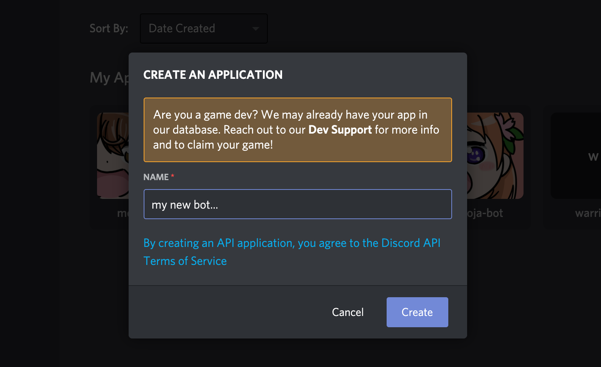
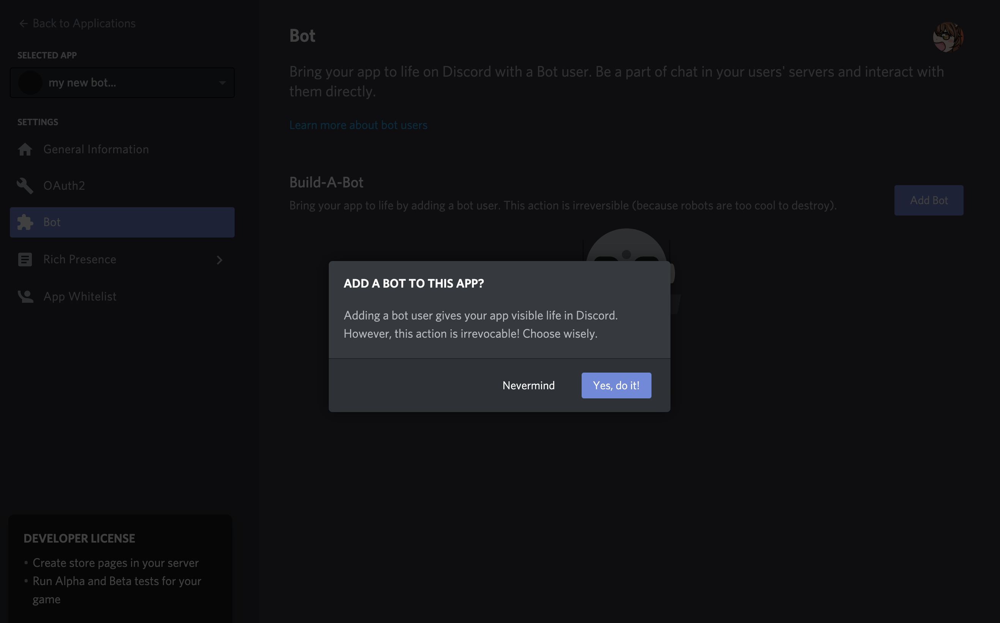
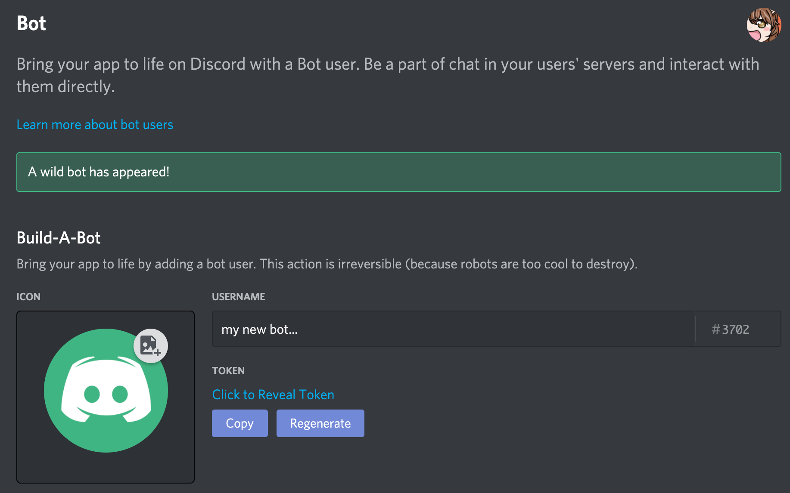
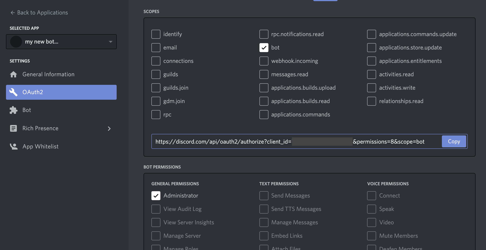

# Contributing

> warriorsbot の開発に参加する

## 開発に参加するには

開発に参加するためには、次の環境の用意が必要です。

### 必須

- Discord のアカウント
- Discord のアプリケーション登録
- Github のアカウント
- "**paiza warriors**" Discord サーバーへの参加
- node.js, npm, git
- 好みのテキストエディタ

### 任意

- docker
- docker-compose

## Discord の開発者登録

warriorsbot を開発し、ローカル環境で動作確認を行うために Discord の開発者登録が必要です。

1. Discord のアカウントを登録します。（すでに登録済みの場合は新たに登録する必要はありません）

2. [Discord Developers Portal](https://discord.com/developers/applications)より、新規に Discord アプリを作成します。
   Icon, Name, Description は任意に設定してください。
   

3. アプリケーション管理画面の「Bot」=>「Add Bot」から、Bot ユーザを作成します。
   Icon, Username は任意に設定してください。ここで設定された Icon と Username が実際に Discord で表示されます。
   

4. この画面から確認できる TOKEN をコピーし、控えておきます。（以後 `DISCORD_BOT_TOKEN` と呼びます）
   **このトークンは絶対に他者に流出しないよう管理してください。**
   

5. アプリケーション管理画面の「OAuth2」=>「OAuth2 URL Generator」から bot の招待リンクを生成します。
   scopes の中から「bot」を選択し、bot permissions の中から適切な権限を選択します。開発用 bot は「Administrator」で問題ありません。

6. 生成された URL をコピーし warriors サーバの管理者権限を持つユーザ(e.g. @s10akir)に通知します。
   

7. bot が Discord サーバに追加されれば完了です。

## Node.js と yarn のインストール

Node.js, yarn をインストールします。

任意の方法で導入済みの Node.js でも問題ありません。その場合は環境に合わせて yarn を導入してください。

docker / docker-compose を利用する場合はインストールされていなくても開発が可能です。

### Mac

```
$ brew install node
$ npm install --global yarn
```

### Ubuntu / WSL

Ubuntu の apt リポジトリから取得できる Node.js のバージョンが古いので、Node.js のバージョンマネージャである n をインストールし、n 経由で stable 版の Node.js をインストールしています。

```
# n は npm からインストールするので、 n を入れるためだけに一度 Node.js をインストールする
$ sudo apt install nodejs npm

# npm から n をインストールする
$ sudo npm install -g n

# n から stable 版の Node.js をインストールする
$ sudo n stable

# n から Node.js をインストールしたので apt から入れた Node.js を削除する
$ sudo apt purge nodejs npm
$ sudo apt autoremove

$ sudo npm install -g yarn
```

## git のインストール

git をインストールします。すでにインストール済みの場合は無視して構いません。

### Mac

```
$ brew install git

```

### Ubuntu / WSL

```
$ sudo apt install git
```

## リポジトリの準備

warriorsbot のリポジトリを取得し、開発に必要な準備を行います。

任意のディレクトリで構いませんが、以後ユーザのホームディレクトリ `$HOME` で作業するものとします。

### リポジトリのクローン

```
# ssh 経由で clone する場合
$ git clone git@github.com/paiza-learning/warriorsbot.git

# https 経由で clone する場合
$ git clone https://github.com/paiza-learning/warriorsbot.git
```

ssh 経由が推奨ですが、github に公開鍵の登録をしていない場合は https で clone します。

### 依存ライブラリを解決する

warriorsbot は typescript で開発しており、npm で依存ライブラリを管理しています。  
warriorsbot のディレクトリ内で yarn を実行することで依存関係が解決されます。

なお、この手順は warriorsbot に依存ライブラリが追加されるたびに必要になります。

```
$ cd warriorsbot
$ yarn
```

### .env に環境変数を記述する

warriorsbot の動作にいくつか必須の環境変数があります。  
これらは実行環境の環境変数として設定しても動作しますが、 `.env` ファイルに記述しておくことで自動で読み込まれるようになっています。

```
$ cd warriorsbot
$ cp .env.example .env

# 任意のエディタで.envを編集する
$ vim .env
```

#### .env

定義されているパラメータは機能が増えていくに伴い随時増えていきますが、ひとまず次の 3 つを正しく設定すれば問題ありません。

| 環境変数名             | 内容                                                                 |
| ---------------------- | -------------------------------------------------------------------- |
| DISCORD_BOT_TOKEN      | DISCORD のアプリケーションを作成した際にコピーした DISCORD_BOT_TOKEN |
| DISCORD_TIMELINE_ID    | TIMELINE チャンネルの ID warrios サーバーの #startup を参照          |
| DISCORD_TIMELINE_TOKEN | TIMELINE チャンネルの TOKEN warrios サーバーの #startup を参照       |

記述例

```
DEBUG=warriors
DISCORD_BOT_TOKEN=xxxxxxxxxx
DISCORD_TIMELINE_ID=00000000000000000
DISCORD_TIMELINE_TOKEN=xxxxxxxxxx
PAIZAIO_API_KEY=guest
```

### warriorsbot を起動する

ここまでの手順がすべて問題なく行われていれば warriorsbot を起動することができます。動作確認を行いましょう。

```
$ cd warriorsbot
$ yarn watch
```

Discord サーバ上のメンバー一覧で自分の bot がオンラインになり、 `/ping` などのコマンドが動作すれば動作確認は完了です。

なお、warriorsbot の管理コマンドには次のものが存在します。詳細は`package.json`を確認してください。

| コマンド     | 内容                                                                                                        |
| ------------ | ----------------------------------------------------------------------------------------------------------- |
| `yarn watch` | 開発用に warriorsbot を起動します。ソースコードを変更するとリアルタイムに再起動されます。（ホットリロード） |
| `yarn build` | 本番用に typescript をコンパイルします。実装時の最終動作確認に使います。                                    |
| `yarn start` | 本番用のコードで warriorsbot を起動します。実装時の最終動作確認に使います。                                 |
| `yarn lint`  | コードに構文エラーやスタイル違反がないかチェックします。                                                    |
| `yarn clean` | 生成した本番用コードを削除します。                                                                          |

### Docker を使う手順（オプション）

warriorsbot の開発環境は、docker と docker-compsoe で揃えることもできます。

#### ライブラリの解決

空の `node_modules` ディレクトリが生成されますが、依存ライブラリは解決されています。  
volume mount でライブラリの配置を切り出しているためです。

ローカル側でライブラリを参照して支援を働かせる機能のエディタ等を使う場合、ローカル側でも `yarn` の実行が必要です。

```
$ docker-compose run --rm warriors yarn
```

#### warriorsbot の起動

`yarn watch` に相当します。

```
$ docker-compose up
```

#### その他の yarn コマンドを実行する場合

```
# 例
$ docker-compose run --rm warriors yarn build
```

## Let's get started!

以上で warriorsbot の開発に参加する準備ができました。  
warriorsbot ではこれらの技術を利用しています。
興味があればドキュメントを読んでみましょう。

| 技術       |                                 |
| ---------- | ------------------------------- |
| typescript | https://www.typescriptlang.org/ |
| discord.js | https://discord.js.org/#/       |
| heroku     | https://jp.heroku.com/          |
